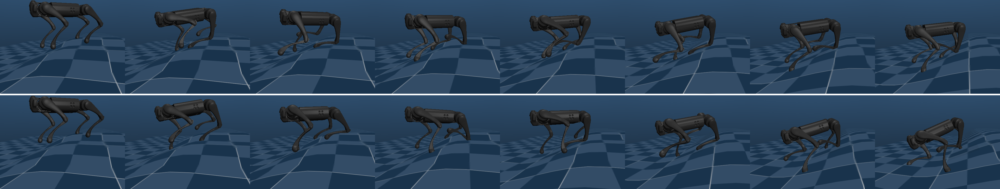

# MJX Go1 Get-Up

**Terrain locomotion + learned fall recovery for the Unitree Go1** — trained end-to-end with
[MJX](https://github.com/google-deepmind/mujoco/tree/main/mjx) (MuJoCo Warp) and
[Brax](https://github.com/google/brax) PPO on a **single 8 GB laptop GPU**. No Isaac, no cluster,
no motion-capture reference.




---

## What is in here

Three pieces, all running the *same* MuJoCo model at 50 Hz in MJX:

| component | what it does | observation | action semantics |
|---|---|---|---|
| **Walk policy** — [`envs/go1_walk.py`](envs/go1_walk.py) | velocity-tracking trot over a procedural height-field terrain (bumps, plateaus, two staircases) | 91 | 12 absolute joint-position targets |
| **Get-up policy** — [`envs/go1_getup_v2.py`](envs/go1_getup_v2.py) | stands up from **arbitrary fallen configurations**, including the poses the walk policy actually ends up in after a real walking fall | 5 × 42 = 210 (frame history) | anchored: `target = home_pose + 0.5·clip(a, ±8)` |
| **Scheduler / viewer** — [`sim/view_go1.py`](sim/view_go1.py) | debounced fall detection → get-up → hand back to walking | — | — |

The interesting part is not "a policy stands up". It is that the *whole chain* is measured with
offline probes: how often a fall is detected, how often the robot gets up, how long it takes, and
what happens in the two seconds **after** control is handed back to the walk policy.

## Results

Every number below is reproducible with the scripts in this repository; the measurement commands
are given in the quickstart, and the raw development log is in
[`docs/experiment-log.md`](docs/experiment-log.md).

| metric | value | how it was measured |
|---|---|---|
| **Get-up from real walking falls** | **77.3 %** (strict) / **81.2 %** (lenient), n = 128 | [`sim/probe_handover.py`](sim/probe_handover.py) `--stage realfall` |
| Time to stand | 5.71 s → **4.89 s** (lenient criterion) | same |
| Fall rate right after hand-back | **7.9 %**, vs 38.3 % with a 10-frame action blend and 73.6 % with 30 | `--stage cycle`, 227 end states |
| Walk policy (60 M steps) | best `eval_reward` 2339.7, mean episode 670 / 750 steps (13.4 s), 0 falls in 30 s rollouts | [`train/train_go1.py`](train/train_go1.py) eval |
| Stairs | down 62–87 %, **up 0 %** — unsolved | [`sim/eval_stairs.py`](sim/eval_stairs.py) |
| Training throughput | get-up **22–25 k steps/s** (40 M ≈ 30 min); walk ≈ 4.4 k steps/s (60 M ≈ 4 h) | RTX 5060 Laptop 8 GB, WSL2 |

### Three findings that took the longest to accept

1. **The criterion is the bottleneck, not the posture.** The get-up policy reliably reaches a
   standing pose (best `up_z` inside the height band: median 0.999), but the old criterion — "the
   pose must hold for 25 *consecutive* frames" — was what failed. Making the counter fault tolerant
   (+1 / −1 instead of reset-to-zero) moved success from 77.3 % to 81.2 % and cut time-to-stand by
   ~0.8 s. **Which `up_z` threshold you pick changes the answer by an order of magnitude**
   (0.99 → 8.1° tilt ≈ 0 %; 0.95 → 18.2° ≈ 77 %); see [`docs/status.md`](docs/status.md) §3.
2. **Blending the two policies' actions is harmful.** The get-up policy stands up *by pushing
   against its action clip* (median |a| = 8.0 = clip). Linearly blending its final target into the
   walk policy's target for the first 10–30 frames pushes the robot over: fall rate 7.9 % → 38.3 %
   (10 frames) → 73.6 % (30 frames). Handing over *hard* is what works.
3. **Action-space anchoring beats reward shaping.** The single biggest change for the get-up task
   was moving from `target = qpos + 0.5·a` (unbounded: the policy must learn joint angles from
   scratch) to `target = home_pose + 0.5·clip(a, ±8)` — the recipe used by the open-source
   [get-up-isaaclab](https://github.com/iit-DLSLab/get-up-isaaclab). Combined with exactly two wide
   Gaussian rewards and *no* posture termination, this is what moved the task from 0 % to ~80 %.
   The full comparison against public implementations (HoST, HumanUP, AFR, …) is in
   [`docs/getup-recipes.md`](docs/getup-recipes.md).

## Install

```bash
git clone https://github.com/TC635807/mjx-go1-getup.git
cd mjx-go1-getup
python -m venv .venv && source .venv/bin/activate
pip install -r requirements.txt
```

Verified with Python 3.14, JAX 0.7.2, MuJoCo 3.12, Brax 0.14.2 and `warp-lang` 1.16 on an
RTX 5060 Laptop (8 GB), WSL2. A CUDA-12 GPU is required for training and strongly recommended for
the viewer; the environment variables that matter (`XLA_PYTHON_CLIENT_MEM_FRACTION`,
`LP_NUM_THREADS`, `GALLIUM_DRIVER`) and every WSL rendering trap we hit are documented in
[`docs/viewer-guide.md`](docs/viewer-guide.md).

## Quickstart

**1. Watch it walk, fall and get back up** (interactive MuJoCo viewer):

```bash
python sim/view_go1.py \
    --pkl policies/go1_walk_policy.pkl \
    --getup_pkl policies/go1_getup_policy.pkl \
    --getup_obs history --getup_action anchored --cmd 0
```

`W/S` change the forward-velocity command, `A/D` turn, `R` resets, `Q` quits. With `--cmd 0`
the robot stays in place, which is the cleanest way to watch recoveries; the default `--cmd 0.5`
walks it off the 6 m terrain edge in 8–16 s (out of bounds is reset, not "get up in mid-air").

**2. Measure get-up success offline** (no rendering, 256 parallel environments):

```bash
python sim/eval_getup.py --task getup_v2 --getup2_action_clip 8.0 \
    --up_th 0.95 --z_lo 0.20 --z_hi 0.34 \
    --pkl policies/go1_getup_policy.pkl --envs 256 --steps 400
```

> ⚠️ `--getup2_action_clip` **must** match training (8.0). Evaluating the released policy with the
> config default (3.0) clips its actions and reports a fake 0 %.

**3. Reproduce the headline number** — walk until it really falls, then hand over to get-up:

```bash
python sim/probe_handover.py --stage realfall --envs 128 --steps 1500 \
    --getup_steps 600 --cmd 0.5 --bound_xy 5.0
```

**4. Train from scratch**:

```bash
# get-up policy: 40 M steps, ~30 minutes on an RTX 5060 Laptop
python -u -m train.train_getup --task getup_v2 --action_clip 8.0 \
    --num_timesteps 40000000 --num_evals 16 --episode_length 400 \
    --num_minibatches 4 --updates_per_batch 5 --lr 5e-4 --entropy 0.005 --init_noise_std 1.0

# walk policy: 60 M steps
python -u -m train.train_go1 --num_timesteps 60000000
```

Checkpoints go to `logs/`, policies to `policies/`. Two self-checks that need no GPU time:
`python -m train.train_getup --dry_run` (builds environment + network only) and
`python sim/probe_getup_v2.py` (environment self-test — run it before changing the get-up
environment).

## Repository layout

```
mjx-go1-getup/
├── envs/                     # MJX environments (physics + task definition)
│   ├── go1_walk.py           #   walk: terrain, reward, termination, 91-dim obs
│   ├── go1_getup.py          #   get-up v1: incremental actions (kept for comparison)
│   ├── go1_getup_residual.py #   get-up on top of the keyframe state machine
│   └── go1_getup_v2.py       #   * get-up v2: anchored actions, wide Gaussians, history
├── train/
│   ├── train_go1.py          # walk training (brax PPO)
│   └── train_getup.py        # get-up training: --task getup | getup_res | getup_v2
├── sim/
│   ├── view_go1.py           # * interactive viewer + walk/get-up scheduler
│   ├── watch_v20_fast.py     #   high-FPS watcher (see docs/viewer-guide.md)
│   ├── eval_getup.py         #   get-up success / posture buckets / time-to-stand
│   ├── eval_walk.py          #   walk evaluation on a fixed spawn set
│   ├── eval_stairs.py        #   stair-climbing success (fixed placement)
│   ├── probe_handover.py     # * quantitative probe of the hand-over moment
│   ├── probe_getup_v2.py     #   get-up v2 environment self-test
│   ├── probe_standability.py #   is the standing criterion reachable at all?
│   ├── probe_nefc.py         #   contact-count overflow probe (see Known issues)
│   ├── gen_terrain.py        #   deterministic terrain generator (hfield PNG + json)
│   ├── getup_keyframe.py     #   scripted keyframe get-up (baseline + viewer fallback)
│   └── common.py             #   shared policy loading (pkl / orbax checkpoint)
├── models/go1/               # MuJoCo model (MJCF + meshes + terrain)
├── policies/                 # released policies (walk v23 @60M, get-up v2f)
└── docs/                     # experiment log, status, viewer guide, get-up recipes
```

## Documentation

| document | contents |
|---|---|
| [`docs/status.md`](docs/status.md) | **start here** — current results, and the exact definition of every criterion (fall detection, standing, hand-over) |
| [`docs/experiment-log.md`](docs/experiment-log.md) | the full development log (§1–§29.28): every failed attempt and the measurement that killed it |
| [`docs/getup-recipes.md`](docs/getup-recipes.md) | line-by-line comparison with open-source get-up implementations (get-up-isaaclab, HoST, HumanUP, AFR) + SOTA survey |
| [`docs/viewer-guide.md`](docs/viewer-guide.md) | how to write a fast MJX viewer: per-frame cost breakdown, JIT traps, WSL rendering |

The deep-dive documents are written in Chinese (they are the original lab notes); the code,
docstrings and this README are in English.

## Known issues & roadmap

* **`njmax=256` is too small for the get-up task.** On the height field a fallen robot needs
  `nefc ≈ 1300` per world; the run emits `nefc overflow` warnings (719 events / 384 k
  world-steps). Retraining with `njmax=2048` is an open item — it does not explain the observed
  instability, but it does affect contact accuracy while the robot is on the ground. Reproduce with
  [`sim/probe_nefc.py`](sim/probe_nefc.py).
* **The get-up policy stands by saturating its action clip** (median |action| = 8.0 = clip, joints
  still moving at 11.5 rad/s). Adding a "quiet standing" term to the reward, or making the success
  bonus require a still posture, is the next quality step.
* **Train/test distribution gap of ~11 points**: 88.7 % from training spawns vs 77.3 % from real
  walking falls. Fine-tuning on a pose pool built from real falls is the planned fix
  ([`sim/make_getup_posepool.py`](sim/make_getup_posepool.py)).
* **Up-stairs is unsolved** (0 % success on the fixed staircase), and walk-policy mirror symmetry
  is imperfect (hip RR/RL drift ≈ 16°).

## Acknowledgements

* [MuJoCo Playground](https://github.com/google-deepmind/mujoco_playground) and
  [Brax](https://github.com/google/brax) — the training stack this project is built on
  (environment API, PPO, MJX/warp backend).
* [get-up-isaaclab](https://github.com/iit-DLSLab/get-up-isaaclab) (IIT-DLSLab) — the get-up recipe
  that `go1_getup_v2.py` follows line by line; [HoST](https://github.com/InternRobotics/HoST) and
  [HumanUP](https://github.com/RunpeiDong/HumanUP) — the multi-critic / two-stage curricula that
  informed the roadmap.
* [quadruped-rl-locomotion](https://github.com/nimazareian/quadruped-rl-locomotion) — the walking
  task was reproduced from this repository, then ported to MJX.
* Unitree Go1 MJCF from [MuJoCo Menagerie](https://github.com/google-deepmind/mujoco_menagerie).

## License

[MIT](LICENSE).
